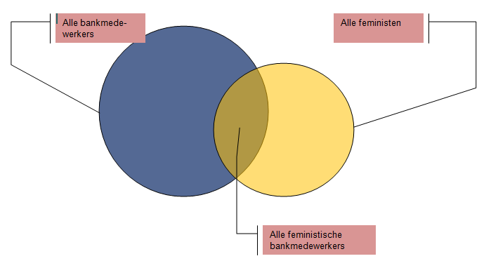

```{r ,echo=FALSE, results='hide', warning=FALSE, message=FALSE,}
# setwd("C:/Users/NB/Google Drive/EVA/R")
library(xtable)
library(reshape2)
library(tm)
library(SnowballC)
library(ggplot2)
library(plyr)
library(tables)
library(gsheet)


# Create data frame from data Google Spreadsheet
url <- "https://docs.google.com/spreadsheets/d/1fmqIXN0lih2Grmaj3O4G_oCG4NSXR-NKUXZ1VNGry70"
answers <- gsheet2text(url, format = "csv", sheetid = NULL)
answers<- read.csv(text = answers)

# Delete irrelevant data
answers <- answers[,-c(1,2,3,4,5,6,7)]
```
Behavioural Economics - Resultaten Experiment
========================================================

Behavioural Economics is de wetenschap van het irrationeel handelen. Het doel van het experiment is illustraties te geven van drie soorten cognitieve fouten: vooringenomenheid (bias), omkadering (framing) en vuistregels (heuristics). Het aantal deelnemers bedroeg: **`r nrow(na.omit(answers))`**.


Vooringenomenheid
-----------------

*"Courage is willingness to take the risk once you know the odds. Optimistic overconfidence means you are taking the risk because you don't know the odds. It's a big difference."* - Daniel Kahneman

### Zelfoverschatting 1

```{r fig.width=7, fig.height=6, ,echo=FALSE, results='asis', warning=FALSE, message=FALSE,}
bias1 <- as.numeric(answers[,1])
exam.exp <- mean(bias1, na.rm = TRUE)*10

# Build histogram
perc <- bias1*10
bias1df <- data.frame(bias1, perc)
ggplot(bias1df, aes(x=perc)) + geom_histogram(breaks=seq(0,110, by=10), colour="black", fill="red") + scale_x_discrete(limits=seq(0,110, by=10)) + xlab("Verwachting slagingskans") + ylab("Frequentie")
```

*Fig. 1: Tijdens de eerste test werd gevraagd hoe hoog de participant (student) de kans inschat dat hij het tentamen haalt. Het histogram toont hoe vaak slagingspercentages werden genoemd. Er kon alleen worden gekozen uit een heel percentage. Of studenten zichzelf overschatten moet nog blijken (het tentamen is nog niet gemaakt). Het maximale verwachte slagingspercentage bedroeg `r max(bias1df$perc, na.rm = TRUE)`. Het vaakst werd `r as.numeric(names(which.max(table(bias1df$perc))))` genoemd (`r max(table(bias1df$perc), na.rm = TRUE)` maal).*


### Zelfoverschatting 2

```{r fig.width=7, fig.height=6, ,echo=FALSE, results='asis', warning=FALSE, message=FALSE,}
## Overconfidence 2
# Select data
bias2 <- answers[12:21]

# delete spaces and dots
bias2 <- as.data.frame(apply(bias2,2,function(x)gsub('\\s+', '',x)),stringsAsFactors = FALSE)
bias2 <- as.data.frame(apply(bias2,2,function(x)gsub('[.]', '',x)),,stringsAsFactors = FALSE)

# divide columns into min and max values
bias2 <- as.data.frame(apply(bias2,2,function(x)colsplit(x, pattern = "tot", names = c('min', 'max'))),,stringsAsFactors = FALSE)
bias2 <- as.data.frame(apply(bias2,2,function(x)as.numeric(x)),,stringsAsFactors = FALSE)

# compare answers with correct values
correct <- c(56000, 4.6, 57, 7511000, 300000, 700405, 12, 200, 193, 128000)

c = 1
d = 1
for(i in correct) {
  bias2[20+c] <- bias2[d] <= i & bias2[d+1]>= i
  c <- c+1
  d <- d+2
}
# count correct answers
bias2$count <- rowSums(subset(bias2, select=21:30))

# add names to new columns
vraagtext <- colnames(answers[12:21])
corpusVraagTxt <-  Corpus(VectorSource(vraagtext))
corpusVraagTxt <- tm_map(corpusVraagTxt, removeWords, stopwords("dutch"))
VraagTxt <- sapply(1:10, function(x) as.character(corpusVraagTxt[[x]]))

colnames(bias2)[21:30] <- VraagTxt

# Build histogram
ggplot(bias2, aes(x=count)) + geom_histogram(breaks=seq(0,11, by=1), colour="black", fill="red") + scale_x_discrete(limits=seq(0,11, by=1)) + xlab("Aantal correcte intervalllen") + ylab("Frequentie")

```

*Fig. 2: Tijdens de tweede test werden 10 vragen voorgelegd. De vragen waren zodanig gekozen dat de deelnemer waarschijnlijk het exacte antwoord niet wist. De opdracht was een interval te kiezen, waarbinnen met 90% zekerheid de werkelijke waarde zou vallen. Als de deelnemer een goede schatting zou maken zou hij in minstens 9 van de 10 gevallen het juiste interval kiezen. In dit geval bedroeg het maximum aantal correct ingeschatte intervals `r max(bias2$count, na.rm = TRUE)` (`r table(bias2$count)[names(table(bias2$count))==max(bias2$count, na.rm = TRUE)][[1]]` maal).*


Omkadering
-------
*"I think one of the major results of the psychology of decision making is that people's attitudes and feelings about losses and gains are really not symmetric. So we really feel more pain when we lose $10,000 than we feel pleasure when we get $10,000."* - Daniel Kahneman


### Loss Aversion

```{r fig.width=7, fig.height=6, ,echo=FALSE, results='asis', warning=FALSE, message=FALSE,}
## Framing
# Select data
framing <- answers[c(2,11)]

# Change answers into factor levels and change level names
names(framing) <- c("winstsituatie", "verliessituatie")
framing$winstsituatie <- as.factor(framing$winstsituatie)
framing$verliessituatie <- as.factor(framing$verliessituatie)
levels(framing$winstsituatie) <- c("W.Risico-avers", "W.Risicozoekend")
levels(framing$verliessituatie) <- c("V.Risico-avers", "V.Risicozoekend")

# Build table
wv <- as.data.frame(acast(na.omit(framing), winstsituatie ~ verliessituatie))
print(xtable(wv, caption = "Aantal personen"), type = "html")

# Calculate percentage with framing tendency
total <- colSums(wv[1])+colSums(wv[2])
seek.aversion <- wv[[2,1]]
aversion.seek <- wv[[1,2]]
switched <- round(100*(seek.aversion + aversion.seek)/total)
```
*Tabel 1: Met de volgende test is onderzocht in hoeverre framing invloed heeft op een economische beslissing. Een uitgangspunt van economisch modelleren is dat alle agents een constant risicogedrag vertonen onafhankelijk van de situatie waarin ze zich bevinden. Als een persoon risico-avers is, zal hij hier altijd naar handelen. Het maakt dan niet uit of het gaat om winst pakken of verlies nemen. In dit geval blijkt `r switched`% beinvloed te worden door het framingeffect en verandert van gedrag naar gelang hij of zij in een winst- of een verliessituatie zit.*


Vuistregels
-------
*"Economists think about what people ought to do. Psychologists watch what they actually do."* - Daniel Kahneman

### Conjunction Fallacy

```{r fig.width=7, fig.height=6, ,echo=FALSE, results='asis', warning=FALSE, message=FALSE,}
## Heuristics
# Select data
linda <- answers[3:10]

# Shorten variable names
names(linda) <- c("Lerares", "Boekhandel en yoga", "Feminist", "Therapeut", "VVK", "Bank", "Verzekeringen", "Bank en feminist")

# Select relevant hypotheses
heuristics <- linda[c(6, 8)]

# Test for heuristic (representativeness) presence and create boolean variable
heuristics$repr <- heuristics[,1] >= heuristics[,2]

# Calculate proportion of respondents subjected to heuristic 
heur.mean <- round(100*mean(heuristics$repr, na.rm = TRUE))
heur <- table(heuristics$repr)
total.heur <- heur[[1]] + heur[[2]]
```
*Tijdens de laatste test werd gemeten in hoeverre personen overschatten op een specifiek geval. Het specifieke geval betrof hier Linda:*

*"Linda is 31 jaar oud, vrijgezel, erg uitgesproken en slim. Ze is afgestudeerd psychologe. Als student was ze erg betrokken bij onderwerpen als discriminatie en sociale rechtvaardigheid en ze nam deel aan antinucleaire demonstraties."*

*Daarna werden een aantal stellingen over Linda gegeven en moesten de deelnemers deze rangschikken van meest naar minst waarschijnlijk. De set bevatte ook de volgende uitspraken:*

*1. Linda werkt bij een bank.*
*2. Linda werkt bij een bank en is actief in de vrouwenbeweging.*

*Van alle deelnemers zei `r heur.mean`% (`r heur[[2]]` van `r total.heur`) dat uitspraak 2 waarschijnlijker is dan 1. Echter uitspraak 1 omvat uitspraak 2. Statistisch is de kans dat de twee feiten over Linda samenvallen (conjunction) kleiner dan de kans dat alleen het feit 1 waar is (zie ook fig.3)*



*Fig.3 Illustratie conjunctie.*